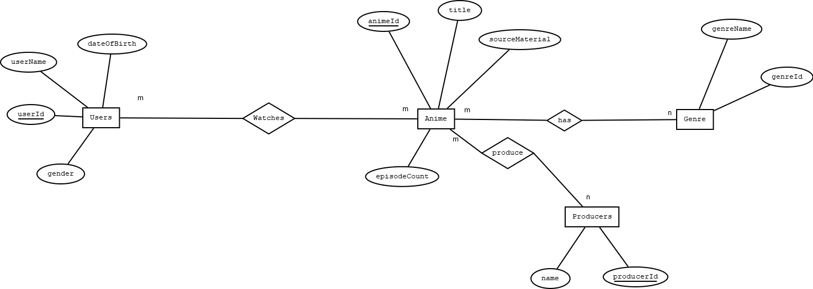

# Anime-Database (Relational)

## About

This is a concept database built with **Microsoft SQL Server** representing how users would be able to have lists of anime and the associations anime would have with genre. 

## Install

Simply run the .sql script inside of SQL Server.

## Diagrams

**Conceptual Model**

**Logical Model**

## Business Logic

Anime Database Business Rules

1. A user is someone who creates an account on the website.
2. Anime are Japanese Animated shows.
3. A genre is an identifier of how anime may have similarities in form and style.
4. A producer is a franchise, company, business, or individual, etc. that produces an anime.
5. A USER may watch 0 or more ANIME.
6. An ANIME may be watched by 0 or more USERS.
7.Every ANIME can be assigned 0 or more GENRE.
8.Every GENRE can be assigned to 0 or more ANIME.
9.Every ANIME may be made by 0 or more PRODUCERS.
10.Every PRODUCER may produce 0 or more ANIME.
11. Each User contains a userName, gender, dateofbirth, and and a userId.
12. An Anime contains a title, sourceMaterial, episodeCount, and has an animeId.
13. A genre has a genreName, genreId.
14. A producer has a name and producerId.
15. The associative entity between User and Anime will be AnimeList.
16. The associative entity between Anime and Genre will be AnimeGenre.
17. The associative entity between Anime and Producer will be AnimeProducer.
18. The associative entities will have the foreign keys of each table and their own primary keys.
19. userName, title, genreName, and producerName will have uniqueness constraints applied to them (Unique index).
20. episodeCount and sourceMaterial will have non-unique indexes applied to them.
